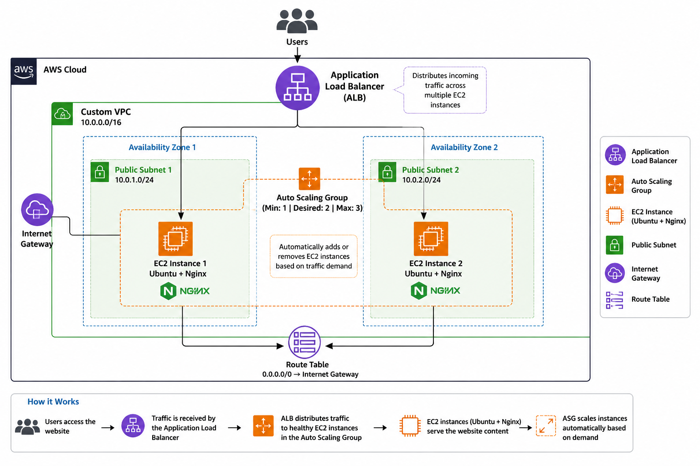

# aws-scalable-web-application

## Architecture Diagram



## Project Overview

This project demonstrates the deployment of a highly available and scalable static website on Amazon Web Services (AWS). The website is hosted on an Ubuntu EC2 instance and integrated with AWS networking and scaling services to ensure availability, reliability, and performance.

## Architecture Components

* Custom Virtual Private Cloud (VPC)
* Public Subnets
* Internet Gateway
* Route Tables
* Ubuntu EC2 Instance
* Nginx Web Server
* Amazon Machine Image (AMI)
* Launch Template
* Auto Scaling Group (ASG)
* Application Load Balancer (ALB)
* Security Groups

## Architecture Flow

Internet Users
↓
Application Load Balancer
↓
Auto Scaling Group
↓
Ubuntu EC2 Instances
↓
Nginx Hosted Static Website

## Objectives

* Host a static website on AWS.
* Configure a custom VPC instead of using the default VPC.
* Implement high availability using Auto Scaling.
* Distribute incoming traffic using an Application Load Balancer.
* Follow AWS cloud infrastructure best practices.

## Deployment Steps

### Step 1: Create a Custom VPC

Created a custom VPC with public subnets across multiple Availability Zones.

### Step 2: Configure Networking

* Created Public Subnets
* Attached Internet Gateway
* Updated Route Tables
* Enabled Internet Access

### Step 3: Launch Ubuntu EC2 Instance

Launched an Ubuntu Server EC2 instance inside the custom VPC.

### Step 4: Install Nginx

```bash
sudo apt update
sudo apt upgrade -y
sudo apt install nginx -y
sudo systemctl start nginx
sudo systemctl enable nginx
```

### Step 5: Deploy Website Files

Uploaded static website files to:

```bash
/var/www/html
```

### Step 6: Create AMI

Created an Amazon Machine Image (AMI) from the configured EC2 instance.

### Step 7: Create Launch Template

Created a Launch Template using the AMI for future instance launches.

### Step 8: Configure Auto Scaling Group

Configured Auto Scaling Group with:

* Minimum Capacity: 1
* Desired Capacity: 2
* Maximum Capacity: 3

### Step 9: Create Application Load Balancer

Configured an Application Load Balancer and attached the Auto Scaling Group.

### Step 10: Test High Availability

Verified that traffic is distributed across healthy instances and that new instances launch automatically when required.

## Technologies Used

* AWS VPC
* AWS EC2
* AWS Auto Scaling
* AWS Application Load Balancer
* AWS Security Groups
* Ubuntu Server
* Nginx
* GitHub

## Features

* Custom AWS Networking
* Highly Available Infrastructure
* Automatic Scaling
* Load Balanced Traffic
* Fault Tolerance
* Cloud Native Deployment

## Future Improvements

* Route 53 Custom Domain
* HTTPS using AWS Certificate Manager
* CloudWatch Monitoring
* CI/CD Pipeline using GitHub Actions
* Infrastructure as Code using Terraform


